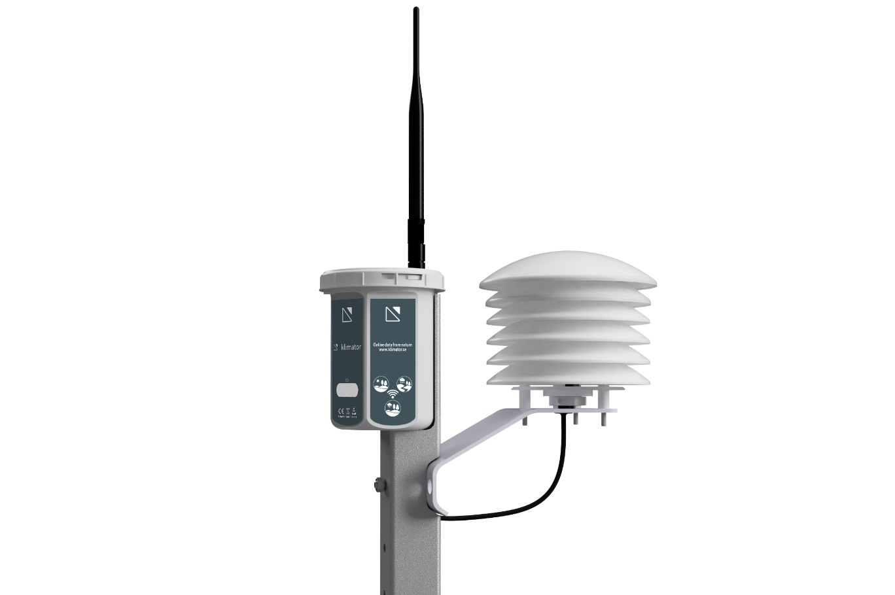
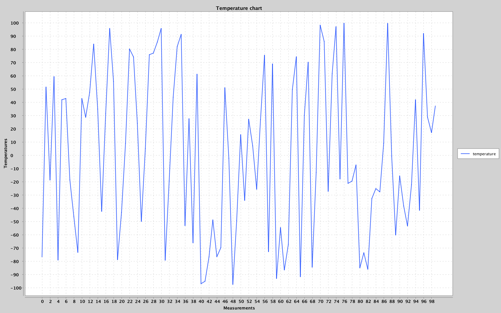

## Sensor API
RESTful service for processing weather sensor data and building a temperature graph.

**Technologies:** Java 17, Spring Boot, Spring Data JPA, RESTful API, Apache Maven, PostgreSQL, xchart.
 
 

### Description
***
This service implies that there are a temperature sensors that measure the temperature of the surrounding air and can determine whether it rains or not.
Sensors have Internet access, so they can send HTTP requests to the server in JSON format.
 
 
### • SensorAPI addresses:

1) Register new Sensor in data base:
<pre>
 POST /sensors/registration 
</pre>
Required JSON format:
<pre>
 { 
    "name": "Sensor name"
 }
</pre>
Note: Sensor name should be between 3 and 30 character. Also sensor name should not be empty. Otherwise an error will be returned.

2) Add new measurement:
<pre>
 POST /measurements/add 
</pre>
Required JSON format:
<pre>
{ 
   "temperature": 24.7,
   "raining": false,
   "sensor:" {
      "name": "Sensor name"
   }
}
</pre>
Note: The value "temperature" must be in range from -100.00 to 100.00. The value "temperature" must be true/false.
The "sensor" value must already be registered in the database. Also this values should not be empty. Otherwise an error will be returned.

3) Return all measurements from the database:
<pre>
 GET /measurements
</pre>
Returns JSON array with the same values as required in POST /measurements/add.

4) Return number of rainy days:
<pre>
 GET /measurements/rainyDaysCount
</pre>
Returns numeric value.
 
 
### • SensorClient
In SensorClient a simulation of sensor registration and sending 1000 random measurements from it is implemented.
Also TempChartBuilder class receives all measurement from the SensorAPI and visualize it as a following chart:
 
 

 
 
### Setup
***
- SensorAPI:
1) To run SensorAPI you should connect PostgreSQL database to project and specify required data in application.properties.
    
2) Also there is SQL code in SensorAPI/src/main/sql folder to create two tables "sensor" and "measurements".
    
3) To start SensorAPI you should run SensorApiApplication class.

- SensorClient:
1) For SensorClient to run, SensorAPI class must be running.
2) To register sensor of measurements, run SensorSimulator class.
3) For get all measurements and build temperature char, run TempChartBuilder class.

